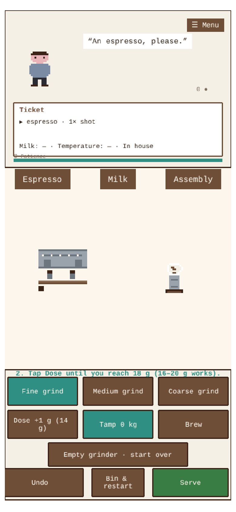
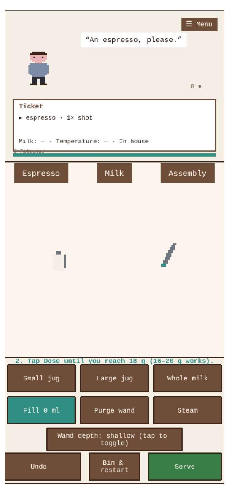
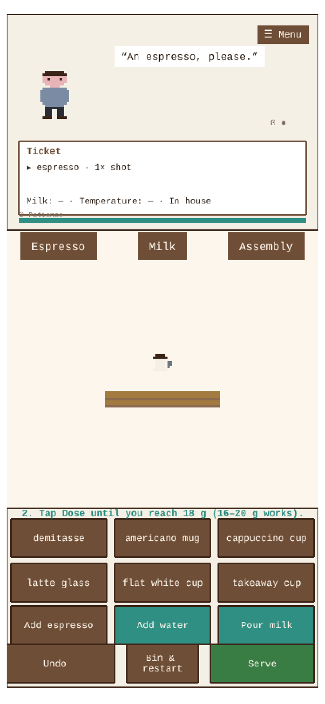
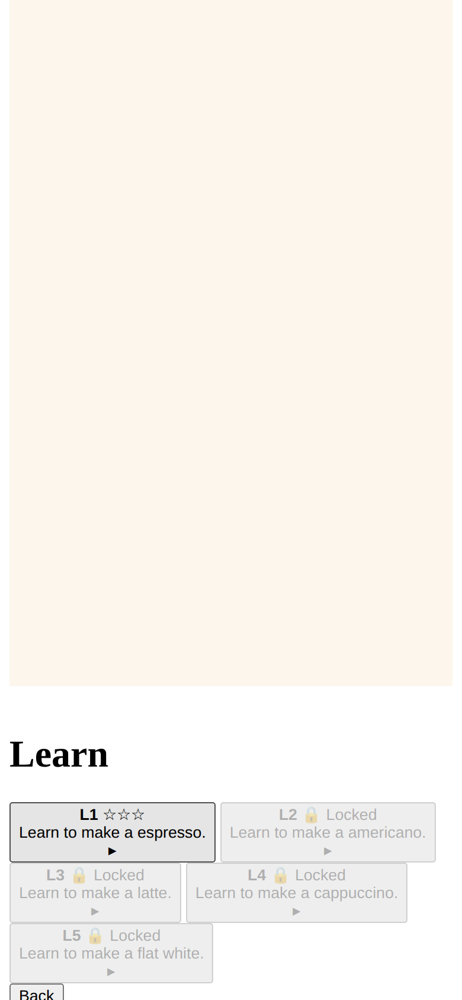
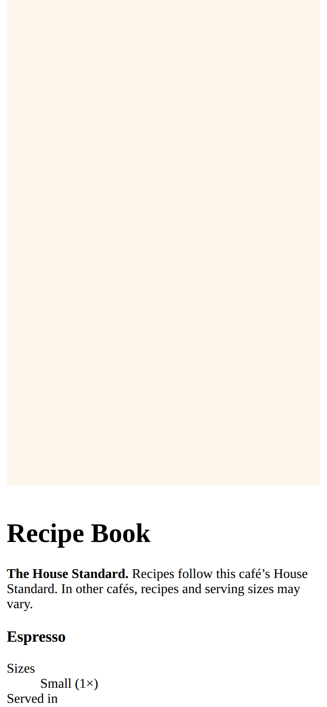
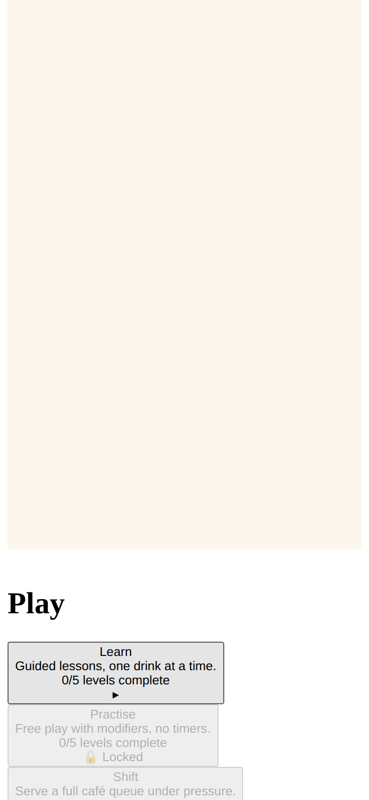
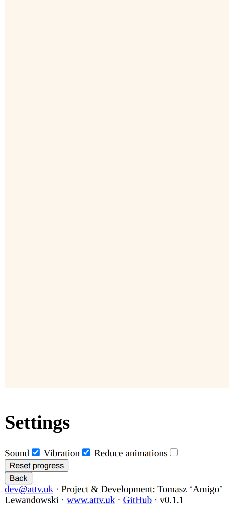

# Coffee Shift

**Learn café-quality coffee, one shift at a time.** A mobile-first browser game that teaches you to
prepare and serve coffee by fulfilling customer orders during short café shifts — recipe-accurate
content, forgiving tolerances, and no account required. Installable as a PWA and fully playable
offline after the first load.

<p align="center">
  
  
  
  
</p>
<p align="center">
  
  
  
  
</p>

## What's in the game

- **Five drinks** built to a House Standard: espresso, americano, latte, cappuccino and flat white —
  sizes, shot counts, milk volumes, foam bands, extraction windows (18 g ± 2, 24–31 s) and par times
  all come from a single recipe data module.
- **Three minigames**: espresso extraction (grind → dose → tamp → brew with live yield), milk
  texturing (jug choice, fill line, wand purge, foam-vs-temperature technique with a shallow/deep
  wand switch) and drink assembly (vessels, shots, water, milk, undo, bin).
- **Three modes, 20 levels**: Learn (guided, one drink per lesson), Practise (free play with
  modifiers, no timers) and Shift S1–S10 (patience, time scoring, parallel prep, order changes and
  two-drink tickets).
- **Grading that teaches**: every serve is scored across order accuracy, recipe, technique, time and
  waste, with plain-English feedback ("The milk was overheated and the foam was too thick for a
  latte. Practise milk temperature control.").
- **Progression without an account**: stars, six-skill mastery tracking, per-drink mastery, habit
  hints ("Your shots run fast — check the grind."), adaptive drink weighting from your fault
  history and a Trainee → Barista rank. Everything stays in `localStorage`.
- **Hand-made pixel art** authored as code data (string maps → canvas textures) — no binary assets
  in the repo — plus WebAudio-synthesised sound effects and haptics, with Sound / Vibration /
  Reduce animations settings.

## Run it

```bash
npm install
npm run dev          # http://localhost:5173 (override with VITE_PORT)
```

Production and tests:

```bash
npm test             # 58 domain unit tests (vitest)
npm run build        # typecheck + production build (PWA, offline precache)
npm run test:e2e     # 10 Playwright browser tests (needs: npx playwright install chromium)
npm run preview      # serve the production build locally
```

Docker:

```bash
docker compose up -d --build   # nginx serving the game on port 4180 (override with APP_PORT)
```

## Project structure

```
src/domain/    pure TypeScript game logic: recipes, orders, grading, progression, save
src/game/      Phaser scenes: three concurrent station simulations, ticket, patience
src/ui/        DOM shell: menus, settings, Recipe Book, summary; all copy in copy.ts
src/sprites/   pixel-art data modules + canvas texture builder
src/style.css  portrait-first, 480px-max, safe-area, ≥48px touch targets
tests/         vitest unit suites + Playwright E2E specs
scripts/       icon generator (hand-rolled PNG encoder), playthrough bot, screenshots
docker/        multi-stage Dockerfile (node build → nginx serve)
```

The domain layer has no Phaser or DOM imports — every gameplay judgement reads from the House
Standard data in `src/domain/recipes.ts`, so the Recipe Book and the grader can never disagree.

## Tools used to tune difficulty

`scripts/playthrough.mjs` is a bot that plays every level through the real UI (scaled game clock,
verified taps) in *clean* and *sloppy* modes and reports per-level score breakdowns. The current
balance — order-derived par times, patience floors of par × 1.2, a human-releasable tamp window and
a re-laid-out button grid with no overlapping hit areas — came directly from its measurements.

---

dev@attv.uk · Project & Development: Tomasz 'Amigo' Lewandowski · [www.attv.uk](https://www.attv.uk) · [GitHub](https://github.com/AmigoUK/CoffeeShift)
